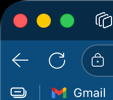
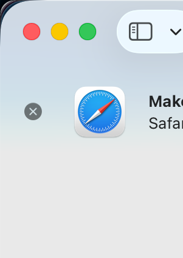
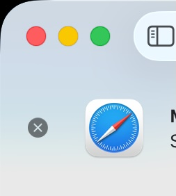
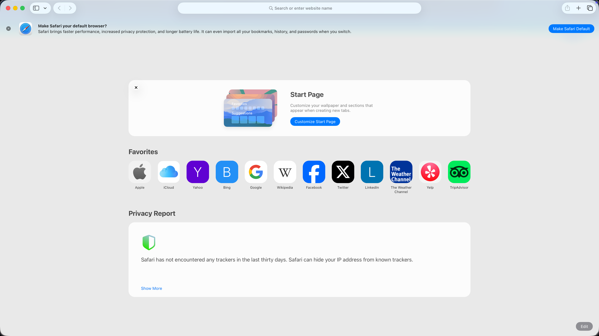
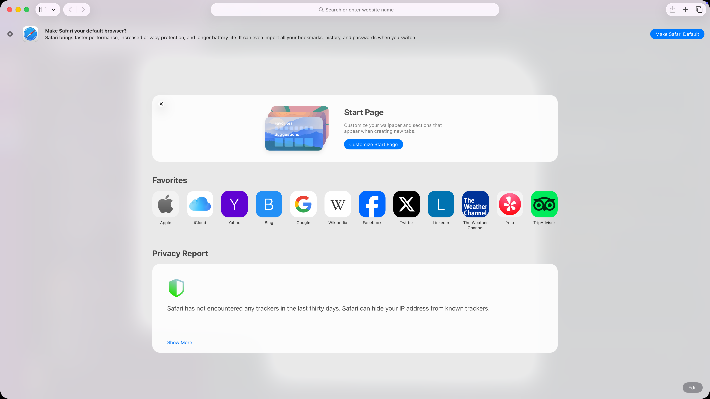

# MacCornerFix

A lightweight macOS utility that fixes the inconsistent corner radius rendering on fullscreen and maximized windows in macOS 26 and later.

## The Problem

macOS 26 introduced inconsistent corner radius rendering for **maximized windows** (windows enlarged via the green button or manually resized to fill the screen). The corners appear randomly rounded with inconsistent radius, which is particularly noticeable and distracting. This does NOT affect native fullscreen apps (which work fine), only maximized windows that still show the title bar.

### Before & After

<table>
<tr>
<td></td>
<td></td>
</tr>
<tr>
<td align="center"><b>Before:</b> Inconsistent rounded corners</td>
<td align="center"><b>After:</b> Fixed corners</td>
</tr>
</table>

<table>
<tr>
<td></td>
<td></td>
</tr>
<tr>
<td align="center"><b>Before:</b> Rounded corners on maximized window</td>
<td align="center"><b>After:</b> Fixed with MacCornerFix</td>
</tr>
</table>

<table>
<tr>
<td></td>
<td></td>
</tr>
<tr>
<td align="center"><b>Before:</b> Distracting rounded corners</td>
<td align="center"><b>After:</b> Fixed corners</td>
</tr>
</table>

## The Solution

MacCornerFix monitors your active windows and automatically detects when you're using a **maximized** window (NOT native fullscreen). It then:

1. Samples the pixel colors from inside the window (near the corners)
2. Creates small overlay windows at each corner
3. Draws those sampled colors over the rounded corners to mask them

The result is corners that match your window content, eliminating the visual inconsistency.

## Features

- Automatic detection of maximized windows (85%+ of screen size)
- Skips native fullscreen apps (they don't have the corner issue)
- Smart color sampling to match window content
- Lightweight menu bar app (no dock icon)
- Privacy-focused (runs locally, no network access)
- Low CPU usage with efficient monitoring

## Requirements

- macOS 13.0 (Ventura) or later
- Accessibility permissions (required to detect window states)

## Installation & Running

### Option 1: Quick Run (Recommended for Testing)

```bash
# Navigate to the project directory
cd MacCornerFix

# Run the app directly
make run
```

This will build and run the app immediately without installing it to your Applications folder.

### Option 2: Build and Install

```bash
# Navigate to the project directory
cd MacCornerFix

# Build the app
make build

# Install to Applications folder
make install
```

After installation, you can launch MacCornerFix from your Applications folder like any other app.

## Accessibility Setup (REQUIRED)

**MacCornerFix requires Accessibility permissions to detect window states and work properly.**

### First Time Setup:

1. Launch MacCornerFix (either via `make run` or from Applications folder)
2. You'll see a prompt asking for Accessibility permissions
3. Click **Open System Settings** (or manually open System Settings)
4. Navigate to **Privacy & Security** → **Accessibility**
5. You may need to click the lock icon 🔒 at the bottom and enter your password
6. Find **MacCornerFix** in the list and enable the checkbox next to it
   - If you don't see MacCornerFix, click the **+** button and add it manually
7. **Restart MacCornerFix** for the permissions to take effect

### If the app still doesn't work after granting permissions:

1. Quit MacCornerFix completely
2. Go back to **System Settings** → **Privacy & Security** → **Accessibility**
3. Toggle the MacCornerFix checkbox **OFF** and then **ON** again
4. Launch MacCornerFix again

## Usage

Once running, MacCornerFix works automatically:

- The app runs in your menu bar (look for the dashed square icon)
- When you **maximize** a window (green button or manually resize), corner overlays activate automatically
- Native fullscreen apps (⌃⌘F) are NOT affected - they don't have the corner issue
- When you resize the window smaller, the overlays disappear
- Click the menu bar icon to access About and Quit options

## How It Works

1. **Window Monitoring**: Uses macOS Accessibility APIs to monitor the focused window
2. **Fullscreen Detection**: Checks both the fullscreen attribute and window dimensions
3. **Color Sampling**: Captures pixel colors from inside the window (25px from corners)
4. **Overlay Rendering**: Creates transparent overlay windows at each corner
5. **Corner Masking**: Draws the sampled colors to mask the inconsistent rounded corners

## Troubleshooting

### The app doesn't seem to work
- Make sure you've granted Accessibility permissions
- Try quitting and restarting the app
- Check that the app is running (menu bar icon should be visible)

### Corners don't match perfectly
- The app samples colors from 25px inside the window
- If your window has a gradient or complex pattern near corners, there might be slight mismatches
- This is normal and usually not noticeable

### Performance issues
- The app updates every 0.5 seconds, which should be imperceptible
- If you experience issues, please report them

## Building

Requirements:
- Xcode Command Line Tools
- Swift 5.9 or later

```bash
# Build only
make build

# Build and run
make run

# Clean build artifacts
make clean
```

## Privacy

MacCornerFix:
- Runs entirely on your local machine
- Does not collect or transmit any data
- Only accesses window information necessary for functionality
- Does not record or store screenshots

## License

MIT License - Feel free to use, modify, and distribute.

## Credits

Created to fix Apple's corner radius inconsistency in macOS Sequoia.

## Contributing

Issues and pull requests are welcome! This is a simple utility, but improvements are always appreciated.

---

**Note**: This is a workaround for a macOS bug. Hopefully Apple will fix the underlying issue in a future update, making this app unnecessary.
